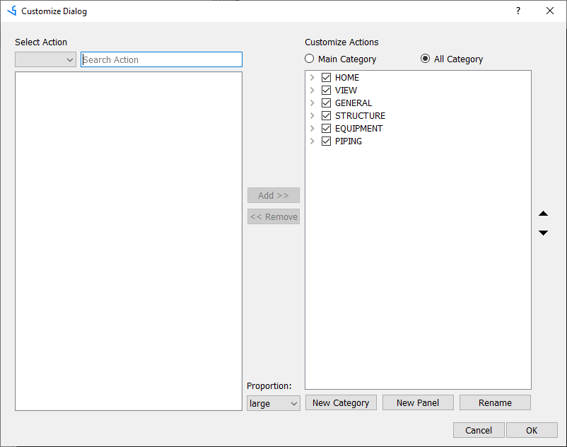
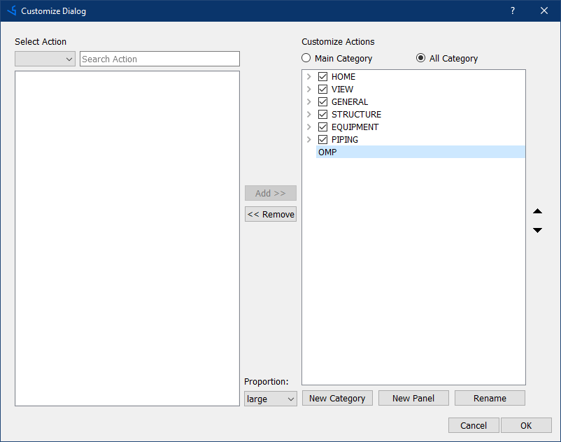
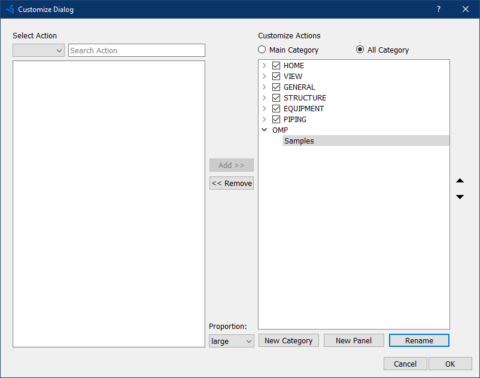
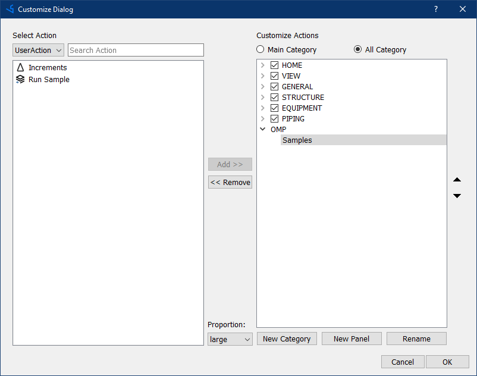
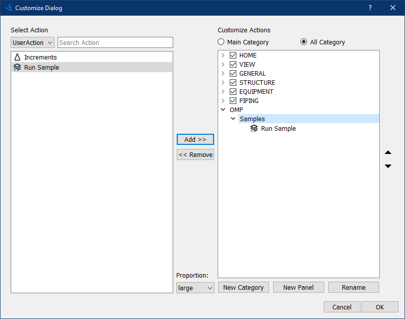
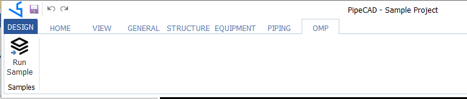

# Настройка ленточного меню
Приложение PipeCAD имеет ленточное меню, которое может быть настроено с помощью формы Customize Dialog.
Чтобы добавить новое меню необходимо выполнить следующие два действия:

To do it there will need to update uic file (for example: PipeCAD.Design.uic ) by adding new line:
```xml
	<Action Key="run_sample" Text="Run Sample" Icon=":/PipeCad/Resources/project_import.png" ToolTip="Run Sample" Module="omp.sample" Function="omp.sample.ShowSample()" />
```
After that in module where you need to add button for calling utility open Ribbon menu editor by pressing button Customisation  located in right top conner of ribbon:


In opened form it possible to create dedicated Tab for developed utilities by pressing button **New Category** in the right part of form.



After creating new element, there is need to select it and press button **Rename** to name it correctly. In our case we will create Tab and call it **OMP**:



Inside this Tab we will create new TabGroup with name **Samples**:



In left part of form select UserAction row in the list to see available options:



After selecting our action **Run Sample** there is need to press button **Add >>** to add action to selected TabGroup:



In the end, you will see new Tab menu with new button:


